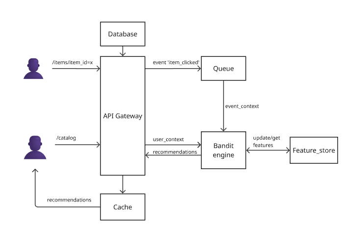
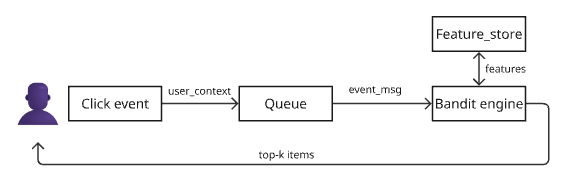

# Лабораторная работа №1
## Постановка задачи и высокоуровневое проектирование
- Студент: Гладкий Андрей Антонович  
- Группа: БВТ2202  
- Тема: Рекомендательная система товаров fashion-сегмента с использованием bandit-алгоритмов (датасет ZOZO)

## 1. Выбор темы
- Тема проекта: Разработка персонализированной рекомендательной системы для интернет-магазина одежды с применением 
"Multi-Armed Bandits" для решения проблемы холодного старта и адаптации к трендам  
- Датасет: ZOZO Dataset

## 2. Формулировка бизнес-задачи и её ML-интерпретация

### Какую проблему решает сервис?
В fashion-сегменте высокий оборот товаров и сильная зависимость от трендов. Пользователи сталкиваются с 
проблемой информационного шума: среди тысяч новинок сложно найти подходящие вещи. Классические алгоритмы, 
например коллаборативная фильрация, плохо работают с новыми товарами и медленно реагируют на изменение вкусов

### Какую выгоду он несет и кто её получит?
- Бизнес: Увеличение конверсии, рост среднего чека, увеличение удержания пользователей за счет релевантных предложений
- Пользователь: Экономия времени на поиск, обнаружение новых подходящих товаров, персонализированная выдача

### Зачем тут МЛ? Какая его функция?
Предсказание вероятности взаимодействия (клик/покупка) пользователя с товаром в конкретный момент времени

### Входные и выходные данные
- Входные данные (Features):
  - Профиль пользователя (история просмотров, пол, возраст)
  - Контекст (время суток, день недели, устройство)
  - Атрибуты товара (категория, цвет, бренд, цена, теги стиля)
- Выходные данные (Prediction):
  - Ранжированный список из Top-N товаров для показа пользователю
  - Вероятность клика (CTR) для каждого товара

## 3. Определение метрик качества
### Бизнес-метрики
| Метрика                  | Описание | Влияние качества на бизнес |
|--------------------------|----------|----------------------------|
| CTR (Click-Through Rate) | Отношение кликов к показам рекомендаций | Чем выше точность рекомендаций, тем чаще пользователи кликают |
 | CR (Conversion Rate) | Отношение покупок к кликам | Релевантные рекомендации приводят к покупкам |

### ML-метрики
| Метрика | Описание                                                                | Влияние качества на бизнес                                                                                                                                        |
|---------|-------------------------------------------------------------------------|-------------------------------------------------------------------------------------------------------------------------------------------------------------------|
| LogLoss | Штрафует за уверенные, но неверные предсказания. Чувствительна к калибровке вероятностей | Хорошо откалиброванные вероятности → более точный ранжинг → выше CTR                                                                                              |
| Cumulative Regret  | Сумма разниц между наградой оптимального действия и выбранного действия | Ключевая для Bandits. Минимизация регрета означает, что алгоритм быстро обучается и меньше показывает нерелевантный контент, что напрямую влияет на CTR и выручку |
 | Precision@K | Доля релевантных товаров в топ-K рекомендациях                          | Показывает, насколько «чиста» выдача. Высокий Precision снижает раздражение пользователя                                                                          |
| NDCG@K | Normalized Discounted Cumulative Gain                                   | Учитывает порядок выдачи. Важные товары должны быть выше, что влияет на вероятность клика                                                                         |

## 4. Источник данных и EDA

Датасет Open Bandit Dataset содержит логи о рекомендованных товарах для пользователей с сайта ZOZOTOWN.
Для сбора датасета в течение 7 дней три группы людей (мужчины, женщины, все) просматривали рекомендации на сайте. 
Для каждой группы рекомендации выбирались по 2м политикам: 
- Случайные (без системы рекомендаций)
- По алгоритму Bernoulli Tompson Sampling (система рекомендации)

Поля логов:
- timestamp - время показа товара пользователю
- item_id - id товара
- position - позиция в интерфейсе (1-3). Центральные всегда чаще выбирают. Это нужно учитввать
- click - 1 - клик, 0 - игнор
- action_prob - вероятность показа товара на этой позиции
- user_features - анонимные признаки пользователя
- user_item_affinity - оценка насколько релевантно для пользователя на основе его истории
- propensity_score - вероятность того, что система показала пользователю именно этот товар на именно этой позиции 
в данный момент времени

Датасет на GitHub: https://github.com/st-tech/zr-obp  
Страница датасетов ZOZO: https://research.zozo.com/data.html

### Анализ разделов датасета
| Политика   | Кампания | Строк | CTR | Уникальных товаров | Признаков пользователя |
|------------|----------|-------|-----|-------------------|----------------------|
| **Random** | All | 1 374 327 | 0.35% | 80 | 4 |
| **Random** | Men | 452 949 | 0.51% | 34 | 4 |
| **Random** | Women | 864 585 | 0.48% | 46 | 4 |
| **BTS**    | All | 12 357 200 | 0.50% | 80 | 4 |
| **BTS**    | Men | 4 077 727 | 0.67% | 34 | 4 |
| **BTS**    | Women | 7 765 497 | 0.64% | 46 | 4 |
| **Всего**  | — | **~26.9 млн** | **~0.55%** | **80 (max)** | **4** |

### Сравнение CTR по политикам и кампаниям:
| campaign / policy | bts | random |
|-------------------| --- | ------ |
| all               | 0.0050 | 0.0035 |
| men               | 0.0067 | 0.0051 |
| women             | 0.0064 | 0.0048 |

### Сравнение bts и random политик
bts имеет более высокий CTR  

### Распределение propensity_score 
На графике видно, что вероятность показа любого товара при random равна 0.33, т.к. это 
вероятность выбора из трех. А вероятность при bts разная для различных товаров. Популярные показываются чаще, 
непопулярные - реже  

## 5. Проектирование высокоуровневой архитектуры системы

### Архитектура системы v1:

### Диаграмма потоков v1:

### Основные компоненты:
 - <b>Bandit engine</b> - "Мозг" системы. Модуль реализует multi-hand bandit алгоритм. Он рекомендует товары и при получении
кликов пользователей пересчитывает статистику. Обновляет feature store. Результаты отправляет на api для вывода пользователю в виде рекомендаций
- <b>Feature store</b> - хранилище признаков пользователей и товаров. Может быть представлена в виде векторной базы данных. Можно использовать chroma
- <b>Queue</b> - очередь для событий от пользователей. Тип события один. Это когда пользователь кликает на товар. Можно использовать kafka
- <b>API Gateway</b> - сервис для обработки запросов пользователей. Можно использовать fastapi+jinja2 либо react
- <b>Database</b> - база данных для хранения данных для сайта магазина. Можно использовать postgres
- <b>Cache</b> - Рекомендации для пользователей могут кешироваться. Можно использовать redis
